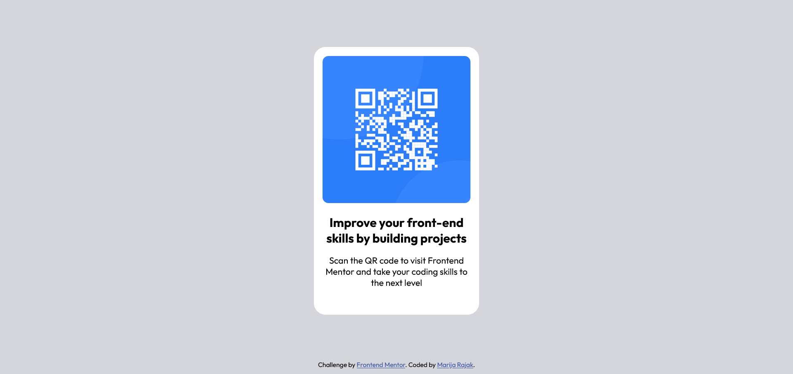

# Frontend Mentor - QR code component solution

## Table of contents

- [Overview](#overview)
  - [Screenshot](#screenshot)
  - [Links](#links)
- [My process](#my-process)
  - [Built with](#built-with)
  - [What I learned](#what-i-learned)
  - [Continued development](#continued-development)
- [Author](#author)

## Overview

### Screenshot

### Link

- Solution URL: https://marija-rajak.github.io/QR-code-component-challenge/

## My process

### Built with

- Semantic HTML5 markup
- CSS custom properties
- Flexbox

### What I learned

My focus lately was JS and Angular, so it is nice to refreshn the basics, from time to time. Also, I took the most simple challenge in order to see how these projects are designed-to complete the documentation, deployment etc.

### Continued development

SInce this was very basic project, it coud be improved by replacing flexbox with grid, or to try Angular (just for fun!)

## Author

- Frontend Mentor - [@yourusername](https://www.frontendmentor.io/profile/marija-rajak)
